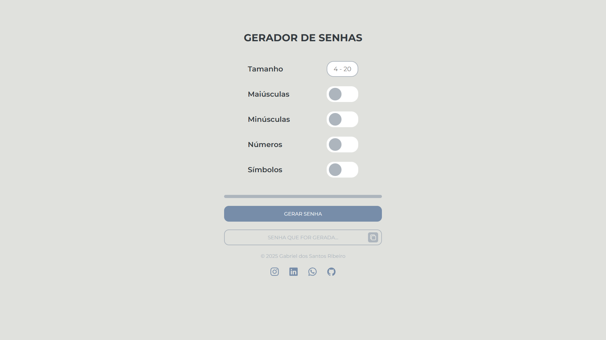
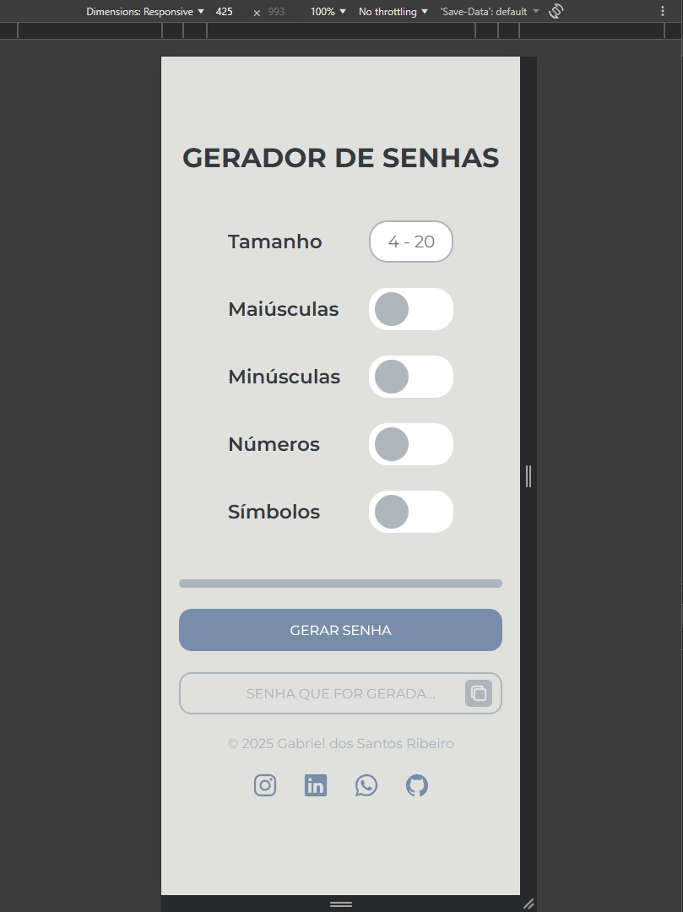
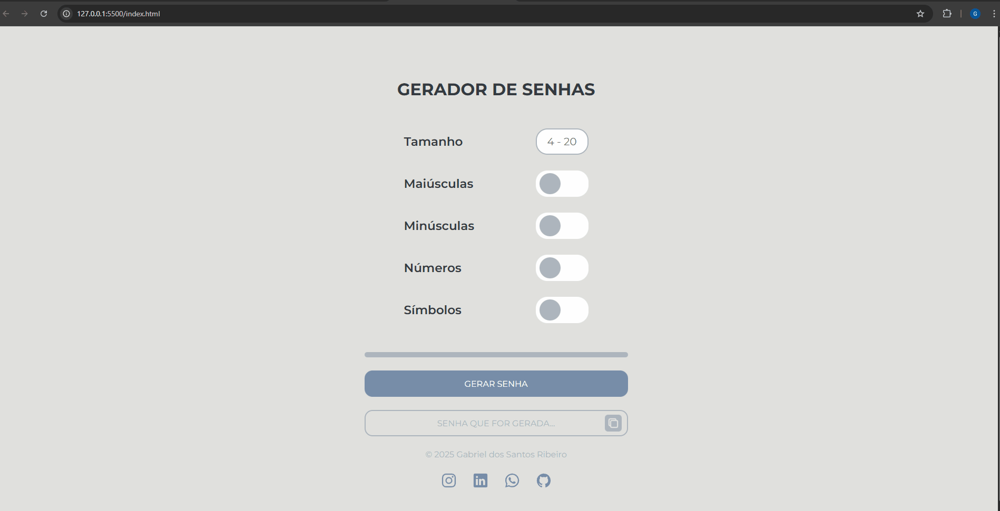

# 🔒 Gerador de Senhas

Um gerador de senhas moderno e personalizável feito com **HTML, CSS e JavaScript**, incluindo uma barra de força dinâmica baseada no tamanho da senha e nas opções selecionadas.

---

## 🔗 Acesse o projeto online
O projeto está disponível para testar no navegador:  
[Visitar Projeto](https://github.com/gabrieldosantosribeiro/gerador-de-senhas-web)

---

## 🖥️ Tecnologias Utilizadas

- **HTML5**  
- **CSS3**  
- **JavaScript**
- Bibliotecas utilizadas: **chance.js**

---

## 🚀 Funcionalidades

- Controle de tamanho da senha (4 a 20 caracteres)  
- Opções para incluir:  
  - Letras maiúsculas  
  - Letras minúsculas  
  - Números  
  - Símbolos  
- Barra de força da senha atualizada em tempo real  
- Copiar senha com um clique  
- Validação do campo numérico enquanto o usuário digita  
- Popup/alerta caso o usuário tente gerar uma senha inválida  

---

## 📊 Cálculo da Força da Senha

A força da senha é calculada considerando:

- Quantas opções estão selecionadas  
- O tamanho da senha

**Fórmula utilizada:**  
força = (tiposSelecionados * 17) + ((tamanho - 4) * 2)

O valor final é aplicado como largura (%) na barra de força.

---

## 📷 Prévia do Projeto

### 🖥️ Versão Desktop


---

### 📱 Versão Mobile


---

### 🎞️ Funcionamento (GIF)


---

## 🧠 O que aprendi com este projeto

- Manipulação da DOM para atualizar elementos em tempo real  
- Uso de eventos como `input`, `click` e `change`  
- Validação de campos numéricos direto no navegador  
- Controle visual usando classes CSS (erro, ativo, desativado)  
- Cálculo de força da senha baseado em regras próprias  
- Uso de checkboxes e leitura dinâmica dos selecionados  
- Alteração de estilos via JavaScript (`style.width`, `classList`)  
- Criação de popups e alertas personalizados  
- Organização do código em funções reutilizáveis  

---

## 📝 Como usar

1. Escolha o tamanho da senha (entre 4 e 20 caracteres).  
2. Marque quais tipos de caracteres deseja incluir:  
   - Maiúsculas  
   - Minúsculas  
   - Números  
   - Símbolos  
3. Clique no botão **GERAR SENHA**.  
4. A senha será exibida automaticamente na tela.  
5. A barra de força mostrará a qualidade da senha.  
6. (Opcional) Clique em **COPIAR** para copiar a senha para a área de transferência.

---

## 📦 Instalação

Clone o repositório:

```bash
git clone https://github.com/gabrieldosantosribeiro/gerador-de-senhas-web.git
```

Abra o arquivo:

```bash
index.html
```

Pronto! O projeto ja funciona localmente.

---

## 📧 Contato

Se quiser falar comigo ou ver outros projetos:
- **Instagram**: [gabsref](https://www.instagram.com/gabsref)
- **LinkedIn**: [gabriel dos santos ribeiro](https://www.linkedin.com/in/gabriel-santos-ribeiro-196110257)
- **GitHub**: [gabrieldosantosribeiro](https://github.com/gabrieldosantosribeiro)